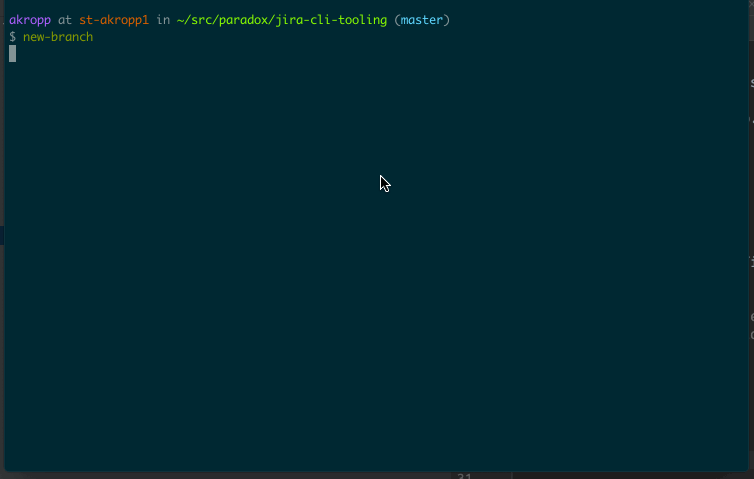

# jira-cli-tooling

JIRA CLI wrapper tooling.  To install run

```
bundle install
```

And source `jira.sh` in your shell.

Also configure https://github.com/go-jira/jira#install

To do that you'll do

```
$ go install github.com/go-jira/jira/cmd/jira@latest
```

When configuring the jira config.yml ensure you add `password-source: keyring` and run `jira session` to add your api token.

You'll want to create a

```
~/.jira.d/custom.yaml
```

That contains the following fields:

```
project: <your root jira project>
```

Also create a


```
~/.jira.d/templates/edityaml
```
For example:

```
fields:
  project:
    key: AB
  issuetype:
    name: Task
  assignee:
    accountId: xxx:60fc2d79-0343-42ab-8a24-92c791c45632
  summary: >-
    {{ or .overrides.summary .fields.summary }}
```

That contains the template fields you want. You may need to put your resolved account ID to get over GDPR api restrictions:

```
/rest/api/3/user/search?query=<e-mail>
```


### Demos

Creating a new jira:


Creating a new branch with a corresponding jira:



### Adding to sprint

To add to sprint you'll want to make a new custom command in `~/.jira.d/conf.yml` which looks something like

```
custom-commands:
  - name: sprint-add
    help: add issue to active sprint for project
    args:
      - name: ISSUE
        required: true
    script: |          
      ROOT_BOARD_ID=1583
      active_sprint=$({{jira}} req "/rest/agile/1.0/board/${ROOT_BOARD_ID}/sprint?state=active" | jq '.values | .[] | select(.originBoardId | contains(${ROOT_BOARD_ID}))')
      sprint_id=`echo $active_sprint | jq '.id'`
      sprint_name=`echo $active_sprint | jq '.name'`
      {{jira}} req -Q -M POST "/rest/agile/1.0/sprint/$sprint_id/issue" "{\"issues\":[\"{{args.ISSUE}}\"]}"     
      echo "{{args.ISSUE}} added to ${sprint_name}"
endpoint: https://jira.<your endpoint>
```

Make sure to change your `${ROOT_BOARD_ID}` to be the board ID of your project. You can usually find this in the URL directly of your jira board.
